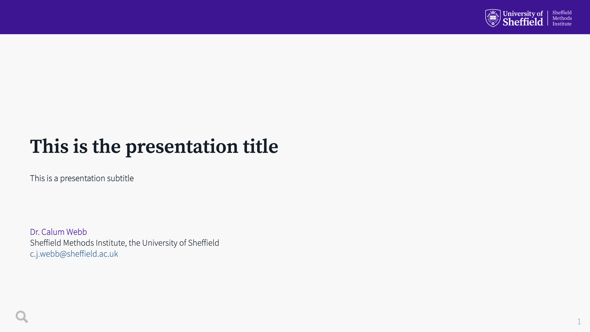
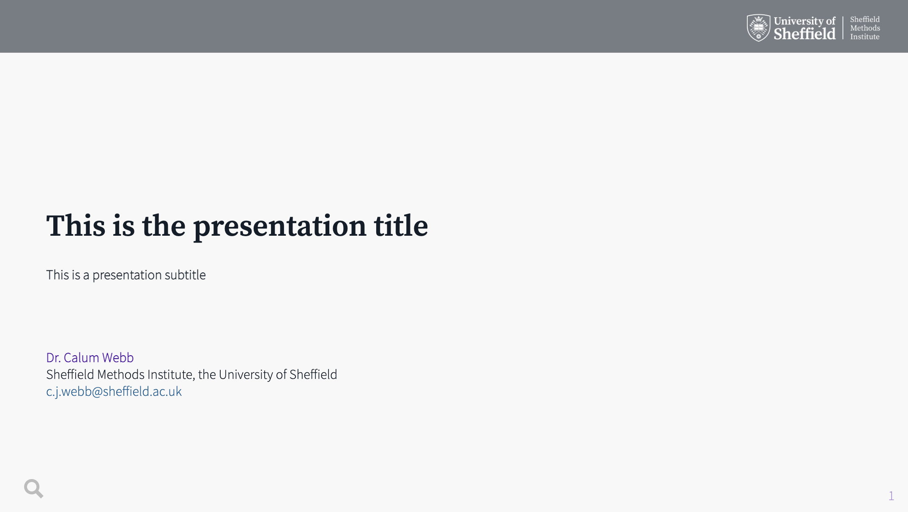

# Sheffield Methods Institute: Custom `xaringan` slide decks

These are custom slide decks for the Sheffield Methods Institute in
University of Sheffield branding. A preview of the slide deck along with
some of the more useful but lesser-known features of
`xaringan`/`react`’s CSS classes are included. It makes extensive use of
`xaringanthemer` and `xaringanExtra` packages.

This slide deck includes a custom top-only banner header in both violet
and midnight black at 90% opacity (dark grey) (found in
`insert-header-violet.html` and `insert-header-grey.html`), some custom
CSS classes (`.middle-left[]` and `.middle-right[]`) to enable
independent vertical centering of `.pull-left[]` and `.pull-right[]`
style slides, as well as some custom 1/4:3/4 style column splits, text
resizing classes.

A live version of the templates can be viewed here:

- Violet:
  [calumwebb.co.uk/pres/smi-slides-demo/violet/](https://calumwebb.co.uk/pres/smi-slides-demo/violet/)
- Grey:
  [calumwebb.co.uk/pres/smi-slides-demo/grey/](https://calumwebb.co.uk/pres/smi-slides-demo/grey/)

