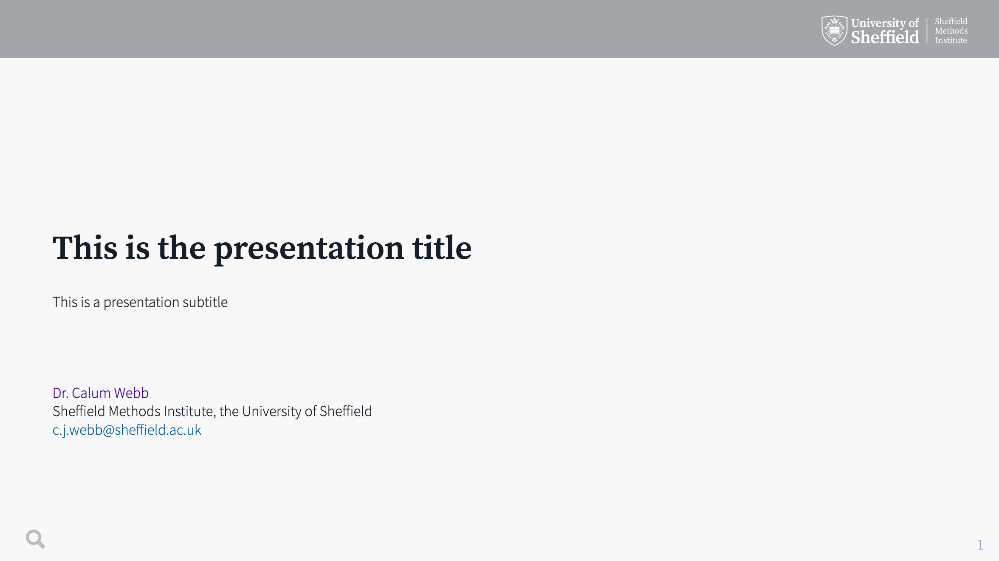

# Sheffield Methods Institute: Custom `xaringan` slide deck

This is a custom slide deck for the Sheffield Methods Institute in
University of Sheffield branding. A preview of the slide deck along with
some of the more useful but lesser-known features of
`xaringan`/`react`’s CSS classes are included. It makes extensive use of
`xaringanthemer` and `xaringanExtra` packages.

This slide deck includes a custom top-only banner header (found in
`insert-header.html`), some custom CSS classes to enable independent
vertical centering of `.pull-left[]` and `.pull-right[]` style slides,
as well as some custom 1/4:3/4 style column splits, text resizing
classes.

A live version of the template can be viewed here:
[calumwebb.co.uk/pres/smi-slides-demo/](https://calumwebb.co.uk/pres/smi-slides-demo/)

